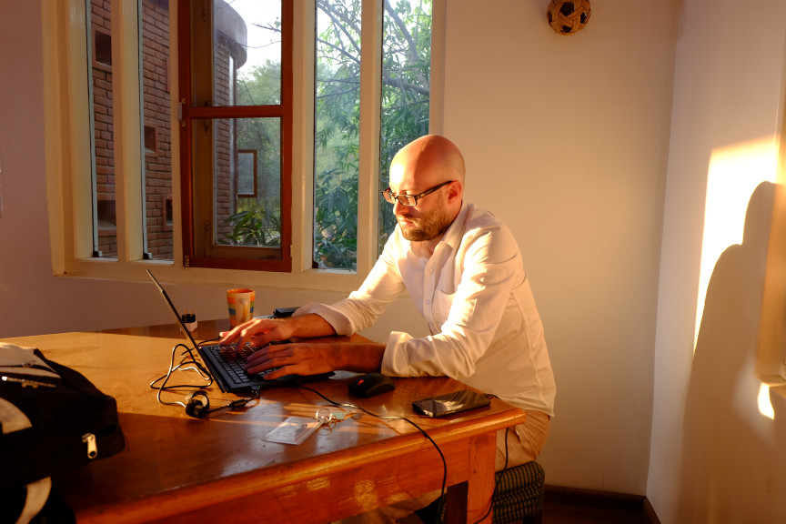

####
Team
####

At this early stage in the 2000 day continuous crowdfund there is only the founder, `Jonathan Brown <http://jonathanpatrick.me/>`_.

He was a participant in the `Drupal <https://www.drupal.org/>`_ web development community for ten years where he created the blockchain Drupal modules `Coin Tools <https://www.drupal.org/project/cointools>`_ and `Ethereum <https://www.drupal.org/project/ethereum>`_. As he fosters the growth of the Link development community, he endevours to replicate the vibrancy of the Drupal development community.

Additional team members will be featured on this page as they are hired.

