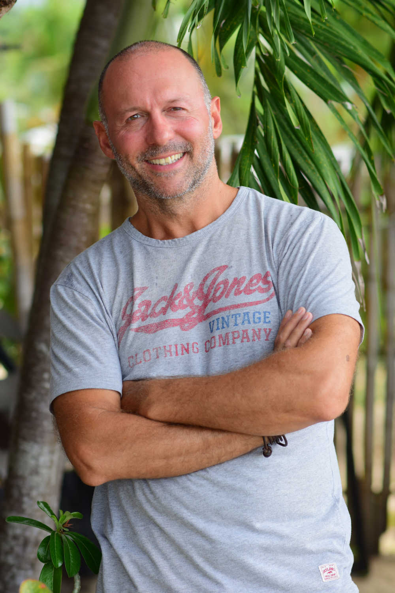

####
Team
####

Jonathan Brown - Founder
--------------------------------------------------------

.. image:: DSCF2528_scaled.JPG
   :alt: Jonathan Brown, Link founder.

`Jonathan <http://jonathanpatrick.me/>`_ was a participant in the `Drupal <https://www.drupal.org/>`_ web development community for ten years where he created the blockchain Drupal modules `Coin Tools <https://www.drupal.org/project/cointools>`_ and `Ethereum <https://www.drupal.org/project/ethereum>`_. As he fosters the growth of the Link development community, he endevours to replicate the vibrancy of the Drupal development community.

James Drummond - Dapp developer
-------------------------------

`James <https://www.linkedin.com/in/yellowmelon/>`_ is a senior developer from London with over ten years experience. He has worked in the finance sector for clients such as HSBC and as senior front end developer for `ALLSAINTS <https://www.allsaints.com/>`_ - an e-commerce site with one million + unique visits / month and frequently £1,000,000+ per day in sales.

More recently he has worked as a contract developer in London, including as senior developer for `RangeRoom <https://rangeroom.com/>`_ - a fashion sector marketplace that he developed from the ground up.

He is founder and developer of `Smoothbook <https://www.smoothbook.co/>`_ - an online appointments system for yoga and fitness studios which currently manages 45,000+ appointments / month.
